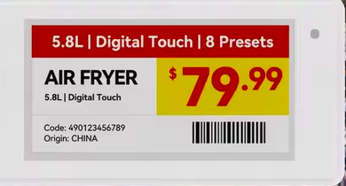
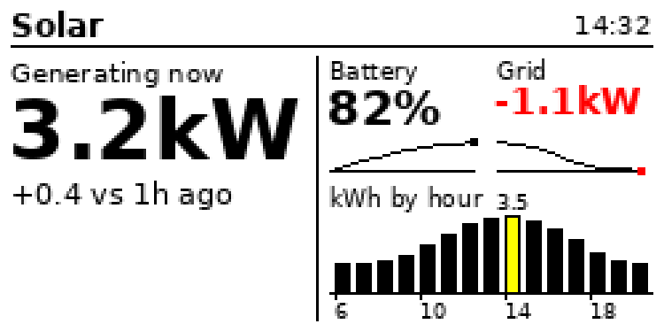

# xte-esl

<p align="center"></p>

Host-side SDK for XTE electronic shelf labels: the BLE e-paper price tags
sold as **Poshiji PSJ-213** (model ESL-21BWRY). It puts an image on the tag
from a laptop in about 2.5 seconds, no base station, no cloud account. The
same firmware family lists five other sizes, none tested here.

The protocol was recovered from the vendor's own app and is documented
clean-room in [`docs/protocol.md`](docs/protocol.md). Every language port is
checked byte for byte against [`testdata/reference.json`](testdata/README.md).
A long-form explainer, including how the e-ink refresh works and why it
flickers, is published at https://mattjoyce.github.io/xte-esl/explainer.html
(source in `docs/explainer.html`).

## Getting a tag

They are sold as generic "4 colour BLE ESL" on AliExpress and similar,
for example [this search](https://www.aliexpress.com/w/wholesale-esl-4-colour.html),
at a few dollars each. Listings never say XTE. The housing is the best
clue before buying: a white rounded case with a small round LED window in
the top-right corner of the bezel, and listing renders showing a red
header band, a yellow price block and a barcode, which is the vendor's
default template. Other ways to tell before or after buying: the seller's app is "POSHIJI ESL Management System" or the web
panel is `esl.pos.cn`; the tag advertises manufacturer ID `0x5258` with
data starting `X` `R` or `X` `T`; the NFC record reads
`<MAC>,<type>,<h>,<w>,BWRY,...`. Gicisky/PICKSMART tags (service `FEF0`) and
OpenEPaperLink-compatible tags are different protocols and will not work
with this SDK.

## Start here

- **Push an image to a tag**: the quick start below.
- **Use TypeScript**: the [SDK quick start](ts/README.md) covers encoding,
  browser uploads, cancellation, and custom BLE transports.
- **Use Go**: the [Go SDK quick start](go/README.md) covers the dependency-free
  codec and uploader, with an optional native Linux BLE adapter.
- **Write another port**: run the Python self-test, read
  [`testdata/README.md`](testdata/README.md), implement protocol.md §7
  against the vectors, then §6, then the transport. Codec before BLE.
- **Look up a byte**: [`docs/protocol.md`](docs/protocol.md). It marks which
  sections were observed on hardware and which were transcribed from the
  vendor app.
- **Understand why**: [the field guide](https://mattjoyce.github.io/xte-esl/explainer.html).
- **Battery life, cadence, running from USB**: [`docs/power.md`](docs/power.md).

## Quick start (Python)

```sh
python3 -m venv .venv && .venv/bin/pip install bleak pillow qrcode
.venv/bin/python python/xte.py                       # codec self-test, no tag needed
.venv/bin/python python/scan.py -t 10                # prints your tag's address
.venv/bin/python python/push.py <address> examples/github-qr.png --no-dither
```

The tag acknowledges in about two seconds and the panel then flickers black
and white for around 20 seconds. That is the refresh. The QR code appears
when it stops.

For a price label, message or QR code without drawing anything:

```sh
.venv/bin/python python/label.py --name "Flat white" --price '$4.20' --note "regular" --push <address>
```

For a mini dashboard (hero figure, stat tiles with sparklines, a column or
line chart, a meter) from a JSON spec, or live data via the
[cookbook](cookbook/):

```sh
.venv/bin/python python/dashboard.py examples/dashboard-solar.json --push <address>
```

<p align="center"></p>

To draw your own, use 250x122 and only pure white, black, red (`FF0000`)
and yellow (`FFFF00`); `examples/qr_label.py` is a worked example. `push.py` rotates it into the tag's portrait buffer, packs,
connects, and pushes. Use `--no-dither` for flat graphics; dithering only
helps photographs and looks poor on a four-ink panel.

Other tools: `python/scan.py` prints and watches the advertisement,
`python/probe.py` is an interactive GATT shell.

## Phone NFC reader

[`docs/nfc.html`](docs/nfc.html) is a standalone, read-only Web NFC page for
Chrome on an NFC-equipped Android phone. Serve it from any HTTPS origin, open
it on the phone, and tap **Start scanning**. It shows XTE identity fields,
the record bytes exposed by the browser, and an exportable log. **Show
example** works without NFC hardware. iPhone browsers do not support Web
NFC, and the page cannot refresh the display. The PSJ-213's malformed NDEF
Text record may be rejected or stripped by the browser; a native NFC reader
app reads it. [NFC findings](docs/nfc-findings.md) has the detail.

## Layout

| path | what |
|---|---|
| `docs/protocol.md` | the wire format and procedures, the single source for ports |
| `docs/explainer.html` | the illustrated guide |
| `docs/power.md` | what the tag draws, cell life against refresh cadence, USB power |
| `testdata/` | conformance vectors and how to use them |
| `python/` | reference codec, BLE pusher, label and dashboard renderers, scan and probe tools |
| `web/` | single-page label editor that pushes over Web Bluetooth from Chrome |
| `skills/xte-push/` | skill that lets a coding agent update the tag with one command; `AGENTS.md` points here |
| `go/`, `ts/` | ports, each with the same self-test contract |
| `cookbook/` | recipes that put live data on the tag: token tracker, solar tracker |
| `examples/` | label renderers, dashboard specs and test images |
| `hardware/` | gitignored. Reverse-engineering kit: ESP32 SWD probe sketch, NFC dump, reference photos. |
| `NOTES.md` | reconnaissance log. Read "Where this stands" at the top; the rest is history, superseded hypotheses included |
| `references/` | gitignored. APK, unpacked bundle, manual. Not needed by ports. |

## Status

| | |
|---|---|
| Codec | verified against vendor vectors |
| Push | verified on PSJ-213, firmware 4.0.2 |
| Geometry | 122x250 portrait buffer, rotate 90 |
| Large images, OTA | specified, not exercised |
| TypeScript | codec passes all vectors; uploader verified on PSJ-213 via bleak bridge and via Web Bluetooth from Android Chrome |
| Go | zero-dependency codec/uploader; all vectors pass; optional Linux BlueZ adapter; Go hardware check pending |
| License | MIT |

## What it is not

Not the Bluetooth SIG ESL profile, not OpenEPaperLink, not Gicisky. Those
tags use different radios or services. The XTE service UUID is the Arm
Cordio proprietary data pipe (`...2760-08C2-11E1-9073-0E8AC72E...`), so the
UUID identifies the BLE stack, not the product.
