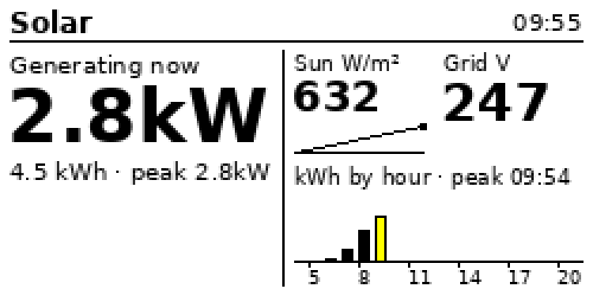
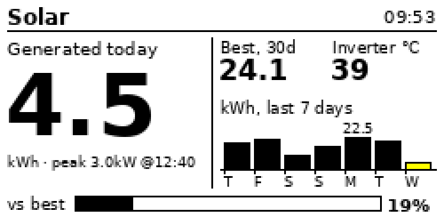

# Solar tracker

A grid-tied inverter's day on the tag, with a different view after dark.

<p> </p>

## Design

The panel has room for one hero figure, two small tiles, one chart and
optionally a meter, in four inks. Two views share that frame:

**Day** (sun up). The number you glance at is generation now, so it is the
hero, with today's kWh and the peak beneath. The two tiles are the inputs a
grid-tied inverter is at the mercy of: irradiance with a three-hour
sparkline, because the irradiance-to-output ratio is the primary diagnostic
for shade, soiling and clipping, and grid voltage, which goes red outside
216 to 253 V because that is what makes inverters trip. The chart is kWh by
hour for the day with the current hour in yellow and the peak time in the
label. No meter: it would only repeat the hero.

**Night** (no generation, after 18:00 or before 06:00). The day is over, so
today's total is the hero, with the peak beneath. Tiles carry the best day
of the last 30 and the inverter temperature. The chart becomes the last
seven days with today in yellow, and a meter shows today against the best
day, which is the one number worth a glance at breakfast.

Red is reserved for the alert states (grid voltage out of range, battery
under 20% on systems that have one). Everything else is black on white.

## Data path

The recipe reads one JSON snapshot and never talks to an inverter itself.
For a GoodWe monitored with the rrdtool stack, `snapshot.py` in that
project's `src/` builds the snapshot inside the `solar-monitor` container:
hourly energy and today's peak from the one-minute archive, the last seven
days and best-of-month from the daily archive, irradiance from the weather
RRD, and the live values from `rrdtool lastupdate`.

```sh
# ad hoc, no deploy: run the exporter in the container over SSH, render locally
unraid_cmd.sh "docker exec -i solar-monitor python3 -" < /path/to/goodwe/src/snapshot.py > snap.json
.venv/bin/python cookbook/solar-tracker/solar.py --file snap.json --push 9F:1D:00:0B:33:36 --if-changed

# deployed: the grapher writes /data/graphs/snapshot.json every 15 min and nginx serves it
.venv/bin/python cookbook/solar-tracker/solar.py --url http://192.168.20.4:8095/graphs/snapshot.json --push 9F:1D:00:0B:33:36 --if-changed
```

Any other source works if it emits the keys in the script's docstring.
`--demo` renders sample data; `--day` and `--night` force a view.

## Cron

```
*/10 5-21 * * *  cd /path/to/xte-esl && .venv/bin/python cookbook/solar-tracker/solar.py --url http://HOST:8095/graphs/snapshot.json --push 9F:1D:00:0B:33:36 --if-changed
0 22 * * *       cd /path/to/xte-esl && .venv/bin/python cookbook/solar-tracker/solar.py --url http://HOST:8095/graphs/snapshot.json --push 9F:1D:00:0B:33:36 --night
```

Ten minutes in daylight is plenty; `--if-changed` keeps the panel still when
nothing moves. The 22:00 line switches to the night view once and leaves it
there until morning.

## Known gaps

- `daily_kwh` is derived from the average power per day, so a day with an
  RRD gap under-reports; the exporter emits `null` for days with no data and
  the recipe draws them as zero.
- The current hour's bar is energy so far this hour, so it is always short
  until the hour ends.
